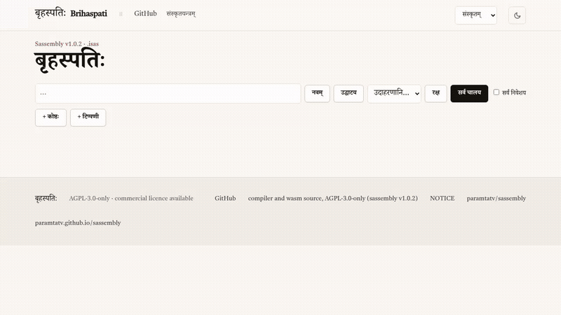

# बृहस्पति

*A 1-minute screen recording of the notebook page: a print, a compute cell showing status and steps, a refusal named in Sanskrit. Click for the mp4.*

Phase 1a: a T1 cell is compiled by the self-hosted Sassembly v1.0.1 compiler image running on
yantra-wasm (node), and the emitted program runs on yantra-wasm. The result equals the native run
byte for byte: emitted ELF, output, finisher status, instruction count, guest RAM size and heap high water.

    sh kernel/fetch-stage1.sh                 # compiler image, sha256-pinned (release asset)
    node kernel/cell.mjs cells/print_x.t1     # JSON: elf_sha256, status, output, steps_compile, steps_run, ...
    sh kernel/native.sh cells/print_x.t1      # same JSON, native yantra-run (needs vendor/yantra-run)
    sh test/expect.sh                         # regenerate cells/expected.jsonl, from native ONLY
    node test/agree.mjs                       # per cell: native == expected == wasm; non-zero on any disagreement

`agree.mjs` first runs a negative control (a flipped field must be reported as a difference), and
refuses an expected row that was not made by the pinned native binary.

Pins (kernel/pins.json). Everything comes from the PUBLIC repository github.com/paramtatv/sassembly, tag v1.0.1
(commit 831e4f0b5f285cefd27d09968e01c5b2fe290afa). Compiler image: that release's
sassembly-v1.0.1-stage1.elf (kernel/fetch-stage1.sh, plain curl). vendor/yantra_wasm.wasm is
`cargo +1.94.0 build --release --locked --target wasm32-unknown-unknown` in crates/yantra-wasm of the tag; the native runner is
`cargo +1.94.0 build --release --locked -p yantra --bin yantra-run`; both built with
`RUSTFLAGS=--remap-path-prefix=<checkout>=/sassembly --remap-path-prefix=$HOME/.cargo=/cargo --remap-path-prefix=$HOME/.rustup=/rustup`
(no local path is embedded). All three are sha256-pinned; the drivers refuse on a mismatch.

Cell convention. The v1.0.1 image has a fixed entry: it links the corpus into an image whose entry
is one named routine of one named module (both in kernel/pins.json, copied from the compiler source
by script). A cell must use that module and entry; both drivers refuse any other with
`CellShapeRefused` (see cells/entry_not_fixed_refused.t1). The cells are existing integer-semantics,
refusal and array programs from Sassembly tests, module and entry renamed by script, plus derived cells
(print, checked add, a heap over 64 MiB). Refusals are finisher statuses 853 (read past length),
860 (checked overflow), 861 (write at -1), 862 (division by zero).

Memory. The compiler needs about 640 MiB of guest RAM (512 MiB .bss heap, stack above it); node
holds about 1.4 GB per compile. The wasm run RAM is sized from the emitted ELF by the native rule
(the larger of 20 MiB and the declared extent plus 16 MiB; crates/yantra/src/lib.rs:241,
:245, :318-338), so both engines get the same RAM (`ram_run` is compared). A program that declares
a 512 MiB heap runs in 553,721,872 octets on both; cells/heap_over_64mib.t1 writes 70 MB of it.
wasm32 would refuse a guest RAM above 4 GiB; nothing here is near it.

Licence. This repository is MIT (LICENSE), except the vendored `yantra_wasm.wasm` (in `vendor/` and `docs/vendor/`), which is AGPL-3.0-only like its source crate `crates/yantra-wasm` in the public paramtatv/sassembly v1.0.1. See `vendor/NOTICE` for the corresponding source and build command, and `vendor/LICENSE-AGPL-3.0` for the text. The native `yantra-run` is built from the same public tag and is not committed here.

The notebook page. `docs/` is the notebook, served at https://paramtatv.github.io/brihaspati and built by
`sh tools/build-docs.sh`: cells of two kinds (code and note), edit, run a cell, run all, add, delete and move cells,
open and save `.isas` files (File API), and a saved-vs-rerun mismatch badge on every code cell. The UI is Sanskrit
first with an en/hi toggle. One worker at a time runs `kernel/core.mjs` (the same file `kernel/cell.mjs` uses). The page
JavaScript is about 26 KB, without the wasm and the compiler image.

The `.isas` format, version 1 (reference parser and writer: `kernel/isas.mjs`; the marker words `कोष्ठः`, `प्रकारः`,
`फलम्` are copied from the format spec into `kernel/isas-names.mjs` by `tools/gen-isas-names.py`). Line 1 is `ISAS 1`; header
lines `key: value` (`title`, `stage1_sha256`, `yantra_wasm_sha256`, `created`; unknown keys are kept); a cell is a marker
line `॥ कोष्ठः N code|note ॥` and its body; a code cell may be followed by `॥ फलम् ॥` and its saved output. A reader refuses by
name: `IsasNotAnIsasFile`, `IsasUnknownMajorVersion`, `IsasMalformedHeader`, `IsasBadCellMarker`, `IsasCellNumberOutOfOrder`,
`IsasOutputOnNote`, `IsasBadOutput`; the writer refuses `IsasUnwritableBody`, `IsasUnknownCellKind`. `examples/*.isas` holds
the 19 cells as three notebooks, with the native runner's outputs saved in them. The output encoding is isolated in
`encodeOutput` and `decodeOutput`.

A refusal is named in Sanskrit, copied from the compiler's `ir.t1` into `kernel/refusals.mjs` by `tools/gen-refusals.py`
(finisher status 853, 860, 861, 862). A driver refusal (`CellShapeRefused`, `StepLimitExceeded`, compile failure) is shown by name.

Worker failures. A cell runs in one worker at a time; a new run first terminates a live one, so two 640 MiB workers never
stack. A worker that dies is `BrihaspatiWorkerDied`, one that does not answer within 180 s is `BrihaspatiTimeout`
("slow device?"); a run that reaches its 4,000,000,000-step budget is `StepLimitExceeded`; a failed guest-RAM allocation says
how many MiB it wanted. The wasm is AGPL-3.0-only: the page footer links its source (sassembly v1.0.1) and `NOTICE`.
Chromium on a desktop grants the 640 MiB compile memory (about 9 s a cell); a phone browser is untested.

Known limits. Fixed entry: a cell must be module शृङ्खला with the entry routine named in `kernel/pins.json`
(anything else is `CellShapeRefused`); no state or import between cells. Compile errors carry no source position. Every cell
starts a fresh engine and compiles from scratch, about 70 to 720 million guest steps.

Tests. `node test/agree.mjs` (native == expected == wasm, 19 cells), `node test/isas.mjs` (round trips and every refusal),
`node test/steplimit.mjs`, `PLAYWRIGHT=<playwright-core dir> node test/isas-page.mjs` (headless Chromium: each example opened,
Run all, every result equal to native; save, reopen, a doctored saved output flagged, worker failures, a live native cell,
page errors fail).
